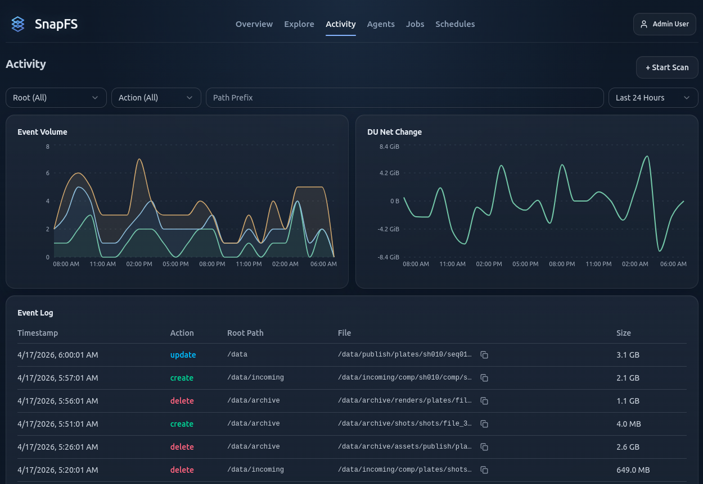

# Activity, Jobs, and History

These pages help you answer different questions:

- `Activity`: what changed?
- `Jobs`: what scans ran, and how did they behave?
- `Compare`: what changed between two scans?

## Activity

Use `Activity` to:

- filter events by root
- narrow by action type
- filter by path prefix
- inspect recent create, update, and delete events

## Jobs

Use `Jobs` to:

- review scan history
- inspect telemetry and issue summaries
- compare a scan to a previous run
- understand whether a scan was manual, scheduled, or API-triggered

## Compare

The compare view is especially useful after a second scan.

Use it to confirm that:

- no-change rescans stay quiet
- real changes are categorized correctly
- unexpected results can be inspected path by path

## Important Note About Deletes

Delete reconciliation depends on authoritative scan coverage. If a scan does not have reliable coverage, delete inference may be skipped to avoid bad data.

## Next Step

Continue with [Troubleshooting](troubleshooting.md).
