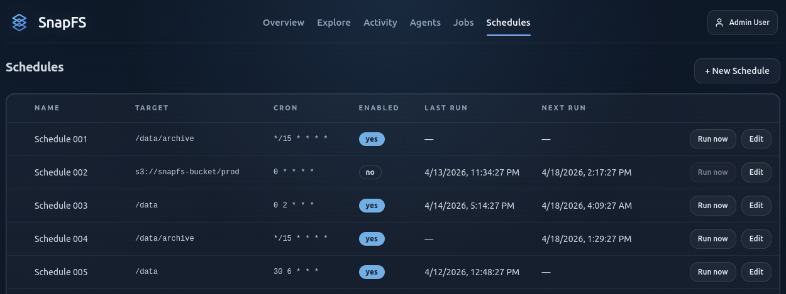
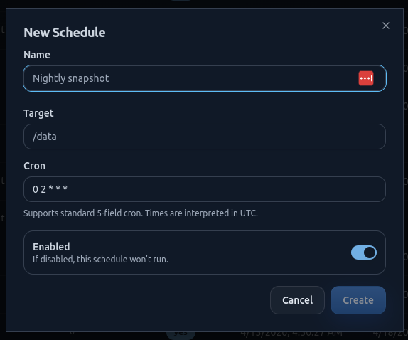

# Creating Schedules

Schedules let SnapFS run scans on a regular cadence.

## Start Small

For beta, the safest approach is:

- create a schedule for a small root or subpath first
- confirm scan behavior
- then expand to a larger scope if the results look correct

## Typical Choices

Useful starting points:

- hourly for a small active folder
- daily for a larger or quieter root
- manual runs for initial validation

## Existing Schedules

Use the `Schedules` page to review and manage recurring scans.

## What To Enter

When creating a schedule, choose:

- a clear schedule name
- the target path to scan
- the run cadence
- whether the schedule is enabled

## Create A Schedule

The create flow should be straightforward: choose a name, target path, cadence, and whether the schedule starts enabled.

## Good Beta Practice

If this is a very large environment, do not start with the full namespace. Validate one or two smaller roots first.

## Next Step

Continue with [Running Your First Scan](running-your-first-scan.md).
