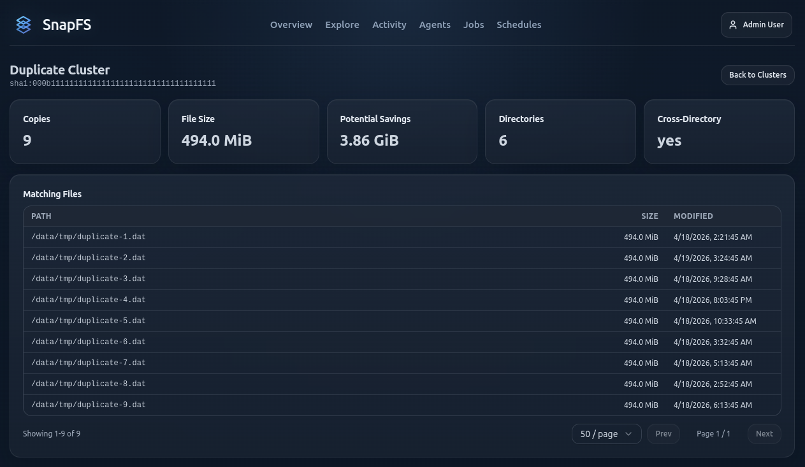

# Exploring Results

Use the console to move from high-level summaries to specific paths.

## Overview

`Overview` helps you spot:

- recent activity
- net growth
- top paths by churn
- top paths by growth

## Explore

`Explore` is the main path-oriented workspace.

Use it to:

- drill into a root or subpath
- browse files and directories
- view growth and churn for the current scope
- filter by extension
- inspect file type breakdowns
- jump to duplicate analysis for the current path

## Files vs Directories

The `Files` and `Directories` views are useful for different questions:

- `Files`: inspect individual items directly under the current path
- `Directories`: inspect child directories and roll-up metrics

## Duplicates

The duplicates workflow helps you understand:

- duplicate groups
- potential savings
- scoped duplicate views for the current path

Start from a narrowed root or subpath when possible. Duplicate analysis is most useful when you already know which area you are evaluating.

### Cluster View

When you open a duplicate cluster, SnapFS shows the exact matching files that belong to that content group.

Use the cluster view to answer questions like:

- how many copies exist
- how large each copy is
- how much space could potentially be saved
- how many directories are involved
- whether the duplicates span multiple directories

The `Matching Files` table helps you inspect the specific paths, file sizes, and modified times for each copy.

### What Potential Savings Means

`Potential Savings` is an estimate of how much space could be recovered if duplicate copies were consolidated.

Treat this as an investigation signal, not an automatic delete recommendation. In beta, use the duplicate views to identify obvious waste, shared content patterns, or unexpected duplication across roots and teams.

### Cross-Directory Duplicates

Cross-directory duplicates are often the most interesting cases because they can reveal:

- repeated ingest or export workflows
- copied project assets
- temporary staging data that accumulates
- content reused across multiple teams or roots

If a cluster spans many directories, review the paths carefully before deciding whether the duplication is intentional.

### Good Beta Practice

When reviewing duplicates:

- start from a smaller scope before scanning an entire namespace for duplicates
- check a few clusters manually to confirm the results make sense
- compare directory locations before assuming files are safe to remove
- use the duplicate data to guide follow-up investigation, not immediate cleanup

For very broad roots, start from a narrower path first if duplicate views feel heavy.

## Next Step

Continue with [Activity, Jobs, and History](activity-jobs-and-history.md).
