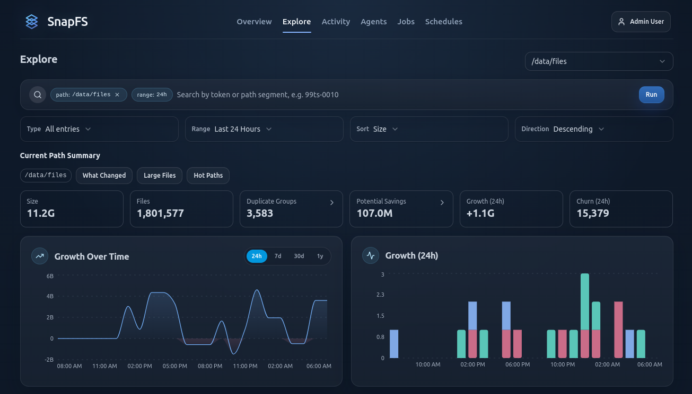

# Exploring Results

Use the console to move from high-level summaries to specific paths.

## Overview

`Overview` helps you spot:

- recent activity
- net growth
- top paths by churn
- top paths by growth

## Explore

`Explore` is the main path-oriented workspace.

Use it to:

- drill into a root or subpath
- browse files and directories
- view growth and churn for the current scope
- filter by extension
- inspect file type breakdowns
- jump to duplicate analysis for the current path

## Files vs Directories

The `Files` and `Directories` views are useful for different questions:

- `Files`: inspect individual items directly under the current path
- `Directories`: inspect child directories and roll-up metrics

## Duplicates

The duplicates workflow helps you understand:

- duplicate groups
- potential savings
- scoped duplicate views for the current path

For very broad roots, start from a narrower path first if duplicate views feel heavy.

## Next Step

Continue with [Activity, Jobs, and History](activity-jobs-and-history.md).
