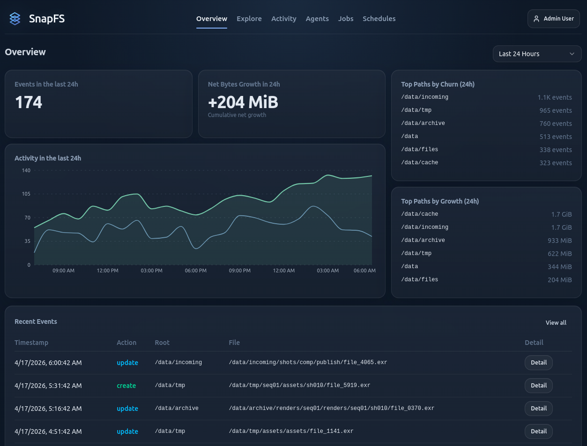

# Getting Started

SnapFS has three main pieces:

- the gateway: receives events, stores queryable history, and serves the API
- the scanner agent: walks a filesystem root and emits scan events
- the console: lets you explore scans, activity, duplicates, and current-state summaries

For most beta users, the first goal is simple:

1. connect a scanner agent
2. create a schedule
3. run an initial scan on a small root
4. confirm the results in the console
5. expand scope gradually

## What A Healthy First Setup Looks Like

After setup, you should be able to:

- see your scanner under `Agents`
- create a schedule for a root or subpath
- run a scan and watch it appear under `Jobs`
- compare a later scan against a previous one
- use `Overview`, `Explore`, and `Activity` to validate that the results make sense

## Recommended First Root

For your first test, prefer a small, familiar path:

- a home directory subfolder
- a project workspace
- a small shared folder

Avoid scanning a very large namespace first. Use the first scan to validate behavior before scaling up.

## Console Overview

The `Overview` page gives a quick read on recent activity, growth, and top paths. Use it as a quick confidence check after your first scan.

## Next Step

Continue with the [Beta Quickstart](beta-quickstart.md).
