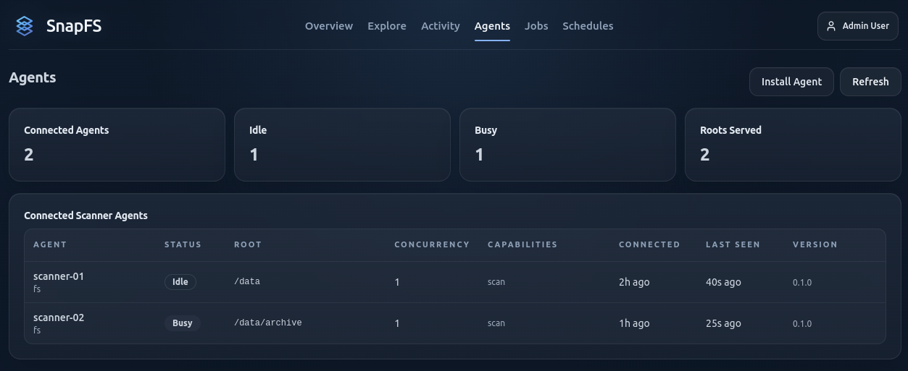

# Installing an Agent

A SnapFS scanner agent is responsible for walking a filesystem root and publishing scan events.

## Platform Support

Today, the supported packaged agent setup path is Linux.

On macOS, you can still run the agent directly after installing the package, but
the packaged Linux `systemd` setup does not apply.

Windows agent install guidance and install scripts are coming soon. If you are
on Windows today, you can continue with one-off CLI scans, or you can wire up
the agent manually if you are comfortable with a DIY setup.

## Before You Install

Make sure you know:

- the gateway URL (e.g. https://example.snapfs.com)
- the root path you want this agent to scan (e.g. `/mnt/data`)
- API keys (see [Managing Access](managing-access.md))

## Install The Agent

If you are installing the long-running agent service on Linux, the preferred
flow is the bootstrap installer:

```bash
curl -fsSL https://raw.githubusercontent.com/snapfsio/snapfs/master/install.sh | bash
```

That bootstrap flow verifies `python3`, prepares the managed SnapFS runtime,
and then launches the Linux `systemd` installer for scanner-specific
configuration. The standard Linux bootstrap install includes `xxhash` support,
so the faster `xxh64` hash algorithm is available during agent setup.

If you prefer to review the installer locally first, the repo-based fallback is:

```bash
git clone https://github.com/snapfsio/snapfs
cd snapfs
./install.sh
```

## Advanced Install Options

If you need manual package or service-install options, see the SnapFS
client docs:

- [Install Guide](https://snapfsio.github.io/snapfs/docs/install/)
- [Systemd Agent Management](https://snapfsio.github.io/snapfs/docs/systemd/)

During `systemd` setup, if you installed `xxhash`, consider setting the agent
hash algorithm to `xxh64`. You can also re-run the installer later with the
same scanner name to update the hash algorithm or worker count on an existing
agent.

## Agent Root Paths

Each scanner agent has a configured root path.

Examples:

- `/mnt/projects`
- `/data/io`

Schedules and manual scans should stay within that root.

## Confirm The Agent Is Connected

After installation, open the console and check the `Agents` page.

You should see:

- the agent id
- connection status
- the configured root path



If the agent is connected and idle, you are ready to create a schedule.

## Next Step

Continue with [Creating Schedules](creating-schedules.md).
