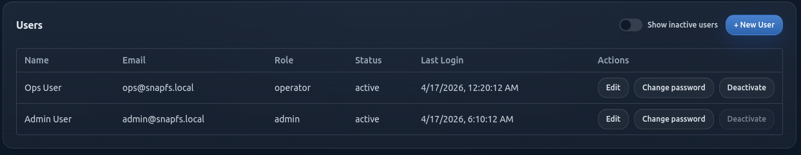
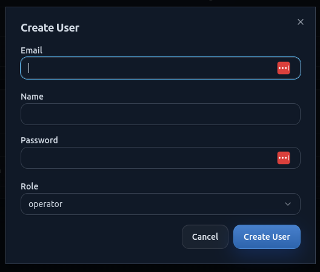
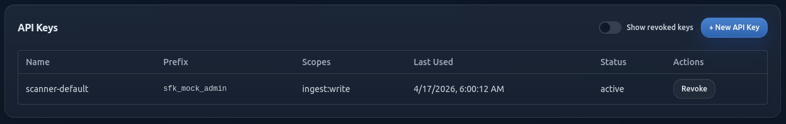
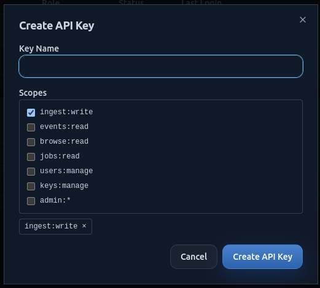

# Managing Access

Use the access controls in SnapFS to manage who can sign in and how automated clients authenticate.

## Users

The `Users` area lets an administrator:

- review existing users
- create new users
- update user details
- manage roles and access status

### Create A User

When creating a user, provide:

- name
- email address
- role
- initial password

### User Roles

SnapFS supports role-based access.

In beta, keep access simple:

- grant admin access only where needed
- use lower-privilege roles for normal users where possible

## API Keys

API keys are intended for authenticated programmatic access.

Use them when you need:

- scripted access
- automation
- integrations that should not rely on an interactive login

### Create An API Key

When creating a key:

- give it a clear label
- store the raw key securely when it is shown
- rotate or revoke keys that are no longer needed

## Good Beta Practice

For early beta users:

- create only the users you need
- use clear labels for keys
- prefer revoking unused keys quickly
- keep admin access limited

## Troubleshooting

If a user cannot sign in or an API key does not work:

- confirm the account is active
- confirm the role has the expected privileges
- confirm the correct key is being used
- try generating a fresh key if needed
