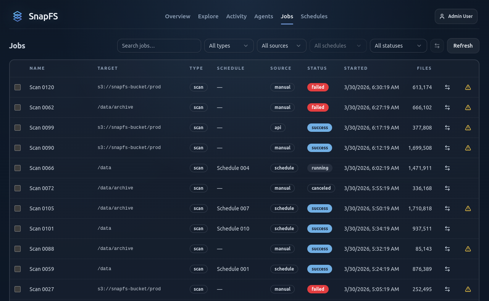

# Running Your First Scan

Once an agent is connected and a schedule exists, trigger your first scan.

## Where To Watch It

Use the `Jobs` page to watch scan progress and inspect the result.

On the Job Details page you can review:

- status
- start and finish times
- files and bytes processed
- telemetry
- scan issues and error summaries

## What To Look For

A healthy first scan should:

- complete successfully
- process the expected root or subpath
- show a plausible file count and byte count
- produce no surprising create/update/delete noise on an immediate rescan

## Compare With Previous

After a second scan, use `Compare to Previous` to confirm that:

- no-change rescans stay quiet
- real creates, updates, and deletes appear where expected

## If Something Looks Wrong

Check:

- the scan issue summary
- the error log
- the root and target path
- whether permissions or coverage problems were reported

## Next Step

Continue with [Exploring Results](exploring-results.md).
